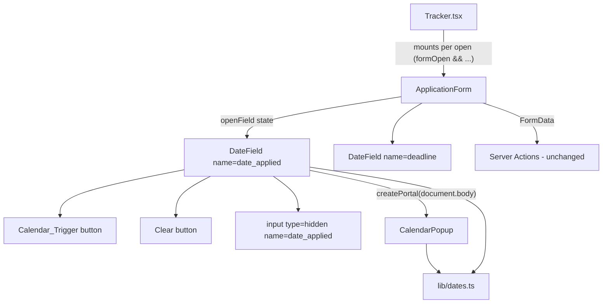

# Design Document: tracker-date-picker

## Overview

The two native `<input type="date">` fields in `ApplicationForm` are replaced by a custom `DateField` with a button trigger and a themed `CalendarPopup`. No runtime date-picker dependency is added. All date maths lives in a pure, time-zone-safe module `lib/dates.ts`, which gets property tests. The form still submits `date_applied` and `deadline` as `YYYY-MM-DD` or `""`, so `app/tracker/actions.ts`, `data/tracker.ts` and the database are untouched (Req 5.2, 8.8).

| File | Change | Requirements |
|---|---|---|
| `lib/dates.ts` | New: pure date logic | 2.1, 2.5, 3.1, 3.2, 5.1–5.5, 6.3, 6.7 |
| `components/tracker/DateField.tsx` | New: label, trigger, Clear, hidden input | 1, 4, 5, 6.1, 6.5 |
| `components/tracker/CalendarPopup.tsx` | New: portal popup, grid, keyboard | 1.4, 1.5, 2, 3, 6.2–6.8, 7 |
| `components/tracker/ApplicationForm.tsx` | Use `DateField` ×2, `openField` state, backdrop logic | 1.3, 7.2, 7.4 |
| `lib/dates.test.ts`, `vitest.config.ts`, `package.json` | Tests and `npm test` | 5.3, 5.4, 8.9 |
| `docs/ARCHITECTURE.md`, `docs/BACKLOG.md`, steering file | Docs | 8.11 |

## Architecture



Decisions:

- **Custom build, no dependency.** The feature is a small month grid. A custom build keeps token-only styling, the exact ARIA wording in Req 6, and zero bundle growth. Req 8.9 doesn't apply because no picker package is added.
- **Plain `{y, m, d}` values.** No code path calls `new Date("YYYY-MM-DD")` or local-time getters on a stored date. Weekday and day arithmetic use `Date.UTC` and `getUTC*`. The only local-time call is `todayLocal()`, which needs the Member's local date on purpose (Req 1.4, 2.4, 6.2).
- **Portal plus `position: fixed`.** The popup escapes the modal panel's box, so it's never clipped (Req 1.5).
- **The hidden input is the only named element.** The trigger, Clear and popup controls have no `name`, so `FormData` gets exactly one value per field (Req 5.2).
- **State resets for free.** `Tracker.tsx` renders `{formOpen && <ApplicationForm …/>}`, so the form, both `DateField`s and `openField` remount on every open. Initial state comes from `application?.date_applied` and `application?.deadline` (Req 5.5, 7.4).

## Components and Interfaces

### `lib/dates.ts` (pure, no React)

```ts
export type CalDate = { y: number; m: number; d: number }; // m: 1–12
export type YearMonth = { y: number; m: number };

export function daysInMonth(y: number, m: number): number;   // Date.UTC(y, m, 0) → getUTCDate()
export function weekdayMon0(date: CalDate): number;           // 0 = Mon … 6 = Sun, via getUTCDay()
export function parseIso(s: string): CalDate | null;          // /^\d{4}-\d{2}-\d{2}$/ + range check, else null
export function formatIso(date: CalDate): string;             // zero-padded "YYYY-MM-DD"
export function formatDisplay(date: CalDate): string;         // "2 Sep 2025"
export function formatAccessibleName(date: CalDate): string;  // "Tuesday 2 September 2025"
export function formatMonthHeading(ym: YearMonth): string;    // "September 2025"
export function todayLocal(now?: Date): CalDate;              // getFullYear/getMonth/getDate (local on purpose)
export function addDays(date: CalDate, n: number): CalDate;   // Date.UTC(...) + n days → getUTC*
export function addMonths(ym: YearMonth, n: number): YearMonth; // total = y*12 + (m-1) + n
export function sameDay(a: CalDate | null, b: CalDate | null): boolean;
export function monthGrid(ym: YearMonth): (CalDate | null)[][]; // Monday-first rows of 7, 4–6 rows
export function yearOptions(currentYear: number, selectedYear: number | null, displayedYear: number): number[];
```

Month and weekday names are hard-coded en-GB arrays rather than `Intl`, so output doesn't depend on ICU data or locale (Req 5.1, 6.7).

```text
monthGrid({y, m}):
  lead  = weekdayMon0({y, m, d: 1})
  cells = [null × lead] ++ [{y, m, d} for d in 1..daysInMonth(y, m)]
  pad cells with null to a multiple of 7, then chunk into rows of 7

yearOptions(cur, sel, disp):
  set = {cur-10 … cur+5} ∪ {sel if not null} ∪ {disp}
  return sorted ascending, unique
```

### `components/tracker/DateField.tsx` (`"use client"`)

```ts
type DateFieldProps = {
  id: string;                    // "date_applied" | "deadline"; used for label htmlFor and ids
  name: string;                  // hidden input name
  label: string;                 // "Date applied" | "Deadline"
  defaultValue: string | null;   // stored ISO or null
  open: boolean;
  onOpenChange: (open: boolean) => void;
};
```

- State: `selected: CalDate | null = parseIso(defaultValue ?? "")`, and a `triggerRef`.
- Renders the following, in today's tab position (Req 6.1):
  - `<label htmlFor={id}>`, using the existing `labelClass`.
  - A wrapper `relative` div with:
    - `<button type="button" id={id}>`, the trigger. It uses `fieldClass` plus `flex items-center justify-between text-left` (Req 8.1). Text is `formatDisplay(selected)` in `text-cream`, or "No date chosen" in `text-dim` (Req 4.3, 5.1). A calendar SVG icon uses `text-gold` with `aria-hidden` (Req 1.1). It also has `aria-haspopup="dialog"`, `aria-expanded={open}`, `aria-controls={popupId}`, `aria-label={`Choose ${label.toLowerCase()}`}`, and `aria-describedby` pointing at a hidden span holding the display text or "no date chosen" (Req 6.5). `onClick` calls `onOpenChange(!open)` (Req 1.2).
    - When `selected` is set, `<button type="button" aria-label={`Clear ${label.toLowerCase()}`}>`, absolutely positioned inside the field's right edge before the icon, with a target of at least 24×24 px. `onClick` runs `setSelected(null)`, `onOpenChange(false)` and `triggerRef.current.focus()` (Req 4.1, 4.2, 8.7).
    - `<input type="hidden" name={name} value={selected ? formatIso(selected) : ""} />` (Req 5.2, 5.6).
  - `{open && <CalendarPopup … />}`.
- Clicking the trigger never shows an on-screen keyboard because it's a `<button>`, not an `<input>` (Req 1.2).

### `components/tracker/CalendarPopup.tsx` (`"use client"`)

```ts
type CalendarPopupProps = {
  id: string;                         // popupId, for aria-controls
  label: string;                      // for aria-label `${label} calendar`
  selected: CalDate | null;
  triggerRef: React.RefObject<HTMLButtonElement | null>;
  onSelect: (date: CalDate) => void;  // DateField: setSelected, onOpenChange(false), focus trigger
  onClose: (opts: { refocus: boolean }) => void;
};
```

- **Internal state**
  - `displayed: YearMonth`, set to the selected date's month, or `todayLocal()`'s (Req 1.4).
  - `focused: CalDate`, set to `selected ?? todayLocal()` (Req 6.2).
  - `announce: string`, initially `""`.
  - `pos: { top, left, width }`.
- **Render**
  - `createPortal(<div role="dialog" aria-label={`${label} calendar`} …/>, document.body)`, with `fixed z-[70] rounded-[3px] border border-card bg-panel-2 p-3 shadow-xl` (Req 1.5, 6.6, 8.2).
  - The header row:
    - `‹` button, `aria-label="previous month"`;
    - the month name;
    - a native `<select aria-label="year">` over `yearOptions(today.y, selected?.y ?? null, displayed.y)`;
    - `›` button, `aria-label="next month"`.
    All are `type="button"` (Req 3.1–3.3, 6.6).
  - `<table role="grid">` with:
    - `<th scope="col" abbr="Monday">Mon</th>` … in `font-mono` (Req 2.1);
    - for each `monthGrid` cell, either an empty `<td />` (Req 2.5, 6.7) or `<td role="gridcell" aria-selected={isSel}>` with a `<button type="button" tabIndex={isTab ? 0 : -1} aria-label={formatAccessibleName(d)} aria-current={isToday ? "date" : undefined}>`.
  - `<div aria-live="polite" className="sr-only">{announce}</div>` (Req 6.8).
- **Day button classes**
  - Base: `h-9 w-9 rounded-[2px] text-[13px] text-cream hover:bg-gold/10 focus-visible:outline-2 focus-visible:outline-offset-2 focus-visible:outline-gold`.
  - Selected: `bg-gold text-base font-semibold` (Req 2.3).
  - Today: `ring-1 ring-gold` (Req 2.4).
  - Header controls use the same focus-visible outline (Req 6.4). No transitions are used (Req 8.4).
- **Roving tabindex**
  - `isTab = sameDay(d, focused)` when `focused` is in `displayed`. Otherwise day 1 is tabbable.
  - An effect focuses the `isTab` button on mount and whenever `focused` changes from a key press. Month buttons and the year select don't move focus (Req 6.8).

#### Keyboard and close handling (pseudocode)

```text
onGridKeyDown(e):
  delta = {ArrowLeft: -1, ArrowRight: +1, ArrowUp: -7, ArrowDown: +7}[e.key]
  if delta: e.preventDefault()
            next = addDays(focused, delta); setFocused(next)
            if (next.y, next.m) != displayed: setDisplayed(next); setAnnounce(heading(next))
  // Enter/Space activate the native <button> → onClick → onSelect(d)   (Req 2.2)

goMonth(n): ym = addMonths(displayed, n); setDisplayed(ym); setAnnounce(heading(ym))   (Req 3.1, 6.8)
onYear(y):  setDisplayed({y, m: displayed.m}); setAnnounce(...)                        (Req 3.3)

root onKeyDown(e):  if e.key == "Escape": e.preventDefault(); e.stopPropagation()
                                          onClose({refocus: true})                     (Req 7.3)
root onClick(e):    e.stopPropagation()                                                (Req 7.1)
root onFocusOut(e): t = e.relatedTarget
                    if t && !root.contains(t) && t != trigger: onClose({refocus: false}) (Req 7.2)

useEffect: document.addEventListener("pointerdown", h)
  h(e): if !root.contains(e.target) && !trigger.contains(e.target): onClose({refocus: false})
```

Notes:

- **Why the root stops click propagation.** React events from a portal bubble through the React tree, not the DOM tree. The modal backdrop (`onClick={onClose}`) is a React ancestor of `DateField`, so a click on a day cell would reach it and close the form. Today the panel's own `stopPropagation` would catch it first. The popup still stops propagation itself so it doesn't depend on that wrapper, which the BACKLOG `<dialog>` refactor may remove.
- **Submission safety.** Popup DOM sits outside the `<form>` element, so its buttons can't submit natively. All buttons are still `type="button"` (Req 7.1).
- **`relatedTarget === null` is ignored on focusout.** Safari doesn't focus buttons on click, and clicks on popup padding blur to `null`. Real outside clicks are handled by the `pointerdown` listener. The trigger is excluded from the outside check so its own `onClick` toggles closed (Req 1.2).
- **Positioning** runs in `useLayoutEffect` on mount and when `displayed` changes, because row count can change height:
  - `width = min(320, innerWidth - 16)`;
  - `left = clamp(rect.left, 8, innerWidth - width - 8)`;
  - `top = rect.bottom + 4`. If that overflows the viewport bottom and there's room above, use `rect.top - 4 - h`. Otherwise clamp to `[8, innerHeight - h - 8]` (Req 1.5).
  - At 320 px the width is 304. The grid needs 7 × 36 + 24 = 276 px. The header needs 2 × 36 + "September" + select, about 250 px (Req 8.6).

### `ApplicationForm.tsx` changes

```tsx
const [openField, setOpenField] = useState<"date_applied" | "deadline" | null>(null);
const popupOpenAtPress = useRef(false);

<div /* backdrop */
  onPointerDown={() => { popupOpenAtPress.current = openField !== null; }}
  onClick={() => (popupOpenAtPress.current ? setOpenField(null) : onClose())}>

<DateField id="date_applied" name="date_applied" label="Date applied"
  defaultValue={application?.date_applied ?? null}
  open={openField === "date_applied"}
  onOpenChange={(o) => setOpenField(o ? "date_applied" : null)} />
// same for "deadline"
```

- Opening one field sets `openField` to it, which closes the other (Req 1.3).
- **Backdrop.** The intended logic is `if (openField) setOpenField(null) else onClose()`. The document `pointerdown` listener has already closed the popup before `click` fires, so `openField` may be stale or null by then. The backdrop's React `onPointerDown` runs before the document listener, so it records the state at press time and the result is deterministic (Req 7.2).
- Cancel and a successful save call `onClose()`. The form unmounts and the popups unmount with it (Req 7.4).
- Every other input is unchanged (Req 8.8).

## Data Models

- **`CalDate { y, m, d }`.** `m` is 1-based. Valid when `1 ≤ m ≤ 12` and `1 ≤ d ≤ daysInMonth(y, m)`. Supported years are 1900–2100 for tests. The logic works for any year ≥ 100.
- **`YearMonth { y, m }`.** Used for the Displayed_Month only, so no day clamping is needed.
- **Submitted_Value.** `formatIso(selected)` gives a 10-char `YYYY-MM-DD`, or `""`. It's the same contract as the native input, so the `Application` type in `data/tracker.ts` (`date_applied: string | null`, `deadline: string | null`) doesn't change.
- **Component state.**

| Owner | State | Notes |
|---|---|---|
| `ApplicationForm` | `openField` | Single-open invariant |
| `DateField` | `selected` | Only changed by a Day_Cell or Clear (Req 3.4, 5.6) |
| `CalendarPopup` | `displayed`, `focused`, `announce`, `pos` | Discarded on close |

## Correctness Properties

*A property is a characteristic or behavior that should hold true across all valid executions of a system-essentially, a formal statement about what the system should do. Properties serve as the bridge between human-readable specifications and machine-verifiable correctness guarantees.*

PBT applies to `lib/dates.ts` only. The UI criteria are covered by the manual checklist below. The generator `arbCalDate` picks `y ∈ [1900, 2100]` and `m ∈ [1, 12]`, then `d ∈ [1, daysInMonth(y, m)]`, so 29 February in leap years is included.

### Property 1: ISO round trip

For any valid `CalDate` from 1900-01-01 to 2100-12-31:
- `formatIso(date)` matches `/^\d{4}-\d{2}-\d{2}$/` and has length 10;
- `parseIso(formatIso(date))` deep-equals `date`.

For any string that isn't a valid ISO date (for example a bad shape, month 13, `2025-02-29` or extra whitespace), `parseIso` returns `null`.

**Validates: Requirements 5.2, 5.3, 5.5**

### Property 2: Time-zone independence

For any valid `CalDate` and any time zone from a sample of 14 that spans UTC−12 to UTC+14, including DST zones (`Etc/GMT+12`, `Pacific/Honolulu`, `America/Los_Angeles`, `America/Sao_Paulo`, `UTC`, `Europe/London`, `Europe/Berlin`, `Asia/Kolkata`, `Asia/Tokyo`, `Australia/Sydney`, `Pacific/Auckland`, `Pacific/Kiritimati`, …):
- `formatIso`, `formatDisplay` and `formatAccessibleName` return the same strings with `process.env.TZ` set to that zone as with `TZ=UTC`;
- `formatDisplay(date)` equals `` `${d} ${MON[m]} ${y}` ``.

**Validates: Requirements 5.1, 5.4**

### Property 3: Month grid completeness

For any `YearMonth` from 1900-01 to 2100-12, `monthGrid(ym)`:
- has 4 to 6 rows, each of length 7;
- contains each day from 1 to `daysInMonth` exactly once, in order, with day `d` in column `weekdayMon0({y, m, d})`;
- has `null` only before day 1 and after the last day.

**Validates: Requirements 2.1, 2.5**

### Property 4: Month navigation inverse and rollover

For any `YearMonth` and any `n ∈ [−1200, 1200]`:
- `addMonths(addMonths(ym, n), −n)` equals `ym`;
- `addMonths(ym, 1)` is `{y + 1, m: 1}` when `m = 12`, and `{y, m + 1}` otherwise;
- `addMonths(ym, −1)` mirrors that rule at January.

**Validates: Requirements 3.1**

### Property 5: Day navigation inverse and boundary crossing

For any valid `CalDate` and any `n ∈ [−400, 400]`:
- `addDays(addDays(date, n), −n)` equals `date`;
- `addDays(date, 1)` is the next calendar day, rolling `d → 1` with the month and year at month and year ends;
- `addDays(date, 7)` equals seven applications of `addDays(·, 1)`.

**Validates: Requirements 6.3**

### Property 6: Year options cover the range and extras

For any `currentYear ∈ [1910, 2095]`, `selectedYear ∈ [1900, 2100] ∪ {null}` and `displayedYear ∈ [1900, 2100]`, `yearOptions` result:
- is strictly ascending, so it has no duplicates;
- contains every year from `currentYear − 10` to `currentYear + 5`, plus `displayedYear`, plus `selectedYear` when it's not null;
- contains nothing else.

**Validates: Requirements 3.2**

## Error Handling

- **A malformed stored value** (not possible today, since Postgres `date` always serialises as ISO) makes `parseIso` return `null`. The field then shows the placeholder and doesn't throw. Submitting would send `""`, which is acceptable for a value that was already invalid.
- **Server Action errors** keep the existing `{ ok: false, error }` path in `ApplicationForm`. No change is needed.
- **`document` access** happens only in effects and the portal, inside `"use client"` components that render after mount. The popup only renders when `open` is true, which can't happen during SSR.

## Testing Strategy

### Setup

- Add pinned devDependencies `vitest@5.0.3` and `fast-check@4.10.2` (current stable from `npm view`). Install with `npm i -D -E`.
- Add the script `"test": "vitest run"`.
- `vitest.config.ts`: `environment: "node"`, and `resolve.alias` for `@` → project root. No extra plugin is needed.
- Tests go in `lib/dates.test.ts`. Each property is one `fc.assert(fc.property(…), { numRuns: 100 })` (or more), tagged with a comment like:
  `// Feature: tracker-date-picker, Property 1: ISO round trip`
- **The TZ approach for P2.** Node re-reads `process.env.TZ` when it's assigned (Node ≥ 13, including Windows via ICU). The test loops over the zone list and sets `process.env.TZ`, then compares outputs against a `TZ=UTC` baseline. A sanity check confirms the switch took effect, by asserting that `new Date(0).getTimezoneOffset()` differs between `Pacific/Kiritimati` and `Etc/GMT+12`. If that check fails on some platform, fall back to spawning `vitest run lib/dates.test.ts` per zone with `env: { TZ }`.

### Example tests

- `formatDisplay({2028, 2, 29})` returns "29 Feb 2028", and `formatDisplay({2025, 9, 2})` returns "2 Sep 2025".
- `formatAccessibleName({2025, 9, 2})` returns "Tuesday 2 September 2025".
- `formatMonthHeading({2025, 9})` returns "September 2025".
- `todayLocal(new Date(2025, 0, 1, 0, 30))` returns `{2025, 1, 1}`.
- `parseIso("2025-09-02")` returns `{2025, 9, 2}`, and `parseIso("")` returns `null`.

### Manual checklist (Req 1, 2.2–2.4, 3.3–3.4, 4, 6, 7, 8)

1. **Mouse.**
   - Each trigger toggles its popup.
   - Opening one popup closes the other.
   - Picking a day fills the field and closes the popup.
   - Prev, next and the year select move the month but leave the field value unchanged.
   - Clear empties the field and doesn't submit.
2. **Keyboard.**
   - Tab order is Company → Position → Date applied → (Clear) → Deadline → …
   - Enter or Space opens the popup and focuses the selected day or today.
   - Arrow keys cross month boundaries.
   - Enter selects a day.
   - Escape closes only the popup and refocuses the trigger.
   - Tab out closes the popup.
   - Focus outline is visible on every control.
3. **Modal.**
   - A backdrop click with a popup open closes only the popup, and a second click closes the form.
   - A click in the panel outside the popup closes only the popup.
   - Cancel and save leave no popup behind.
   - In edit mode, open → navigate → close → save keeps the stored dates.
4. **Screen reader** (NVDA + Chrome, VoiceOver + Safari).
   - The trigger reads "Choose date applied", the value or "no date chosen", and collapsed or expanded.
   - The dialog name is read.
   - Day names read in full, with selected and current-date states.
   - The month change is announced once.
5. **Layout.**
   - At 320 px and 400 px widths, the popup fits with no horizontal scroll.
   - Near the bottom of the viewport the popup flips above.
   - Check iOS Safari and Android Chrome tap behaviour, with no on-screen keyboard.
6. **Time zone.** With the OS zone set to `America/Los_Angeles`, editing a stored `2025-09-02` shows "2 Sep 2025".
7. **Browsers.** Run on current stable Chrome, Edge, Firefox and Safari (Req 8.5).

Optional future work: component tests with `@testing-library/react` and `jsdom` for the DateField and modal interactions.

### Verification gates

`npm test`, `npm run lint` and `npm run build` must all exit 0 with no new warnings (Req 8.10).

## Documentation (Req 8.11)

- **`docs/ARCHITECTURE.md`.** Add `DateField` and `CalendarPopup` (portal, single-open via `openField`, backdrop rule), `lib/dates.ts` (UTC-safe `{y, m, d}` helpers) and the `npm test` script. Also note that no picker package was added.
- **`docs/BACKLOG.md`.**
  - There's no existing date-picker item to tick.
  - Add a new item: `formatDate()` and `formatShortDate()` in `data/tracker.ts` parse `YYYY-MM-DD` as UTC midnight, so the table and board show the previous day in negative-offset zones. The fix is to reuse `parseIso` and `formatDisplay` from `lib/dates.ts`.
  - Mention on the existing `ApplicationForm` dialog item that the Escape handler on the popup already calls `stopPropagation`.
- **Steering file** (`.kiro/steering/`, the project context rule). Change the "no test suite yet" line to: verify with `npm test`, `npm run lint` and `npm run build`.
